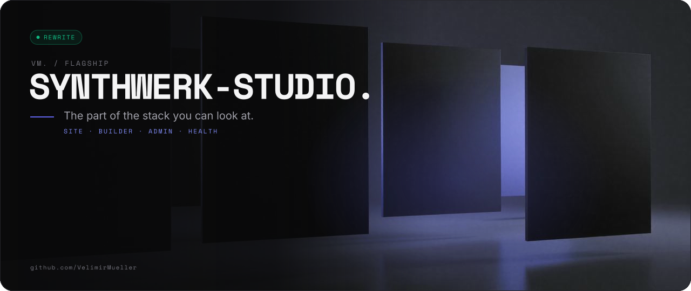
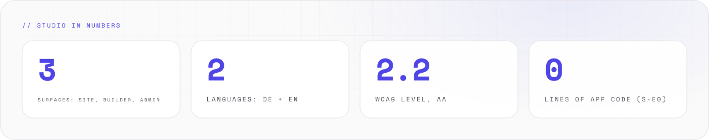
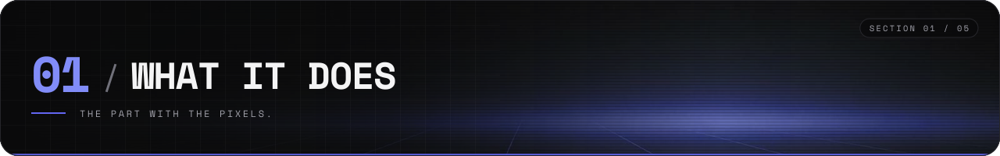
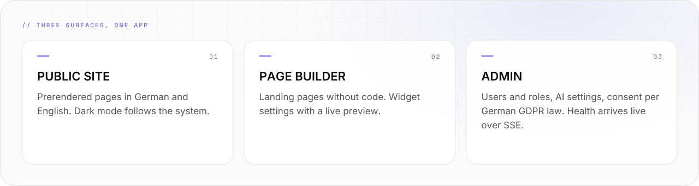
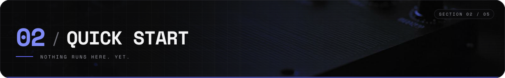
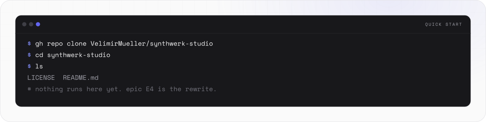
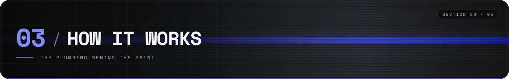
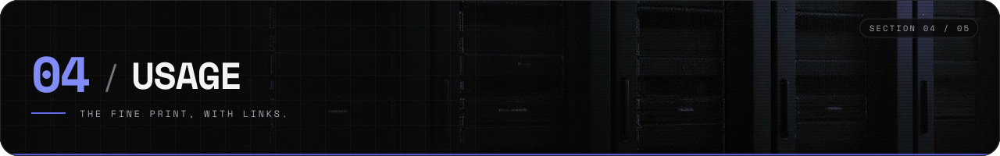
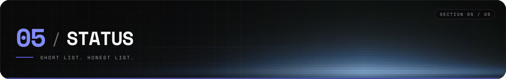
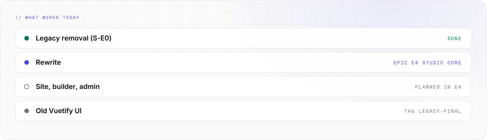

<picture>
  <source media="(prefers-color-scheme: light)" srcset="assets/banner/hero-v2-light.svg">
  
</picture>

<p align="center">

[](#-05-status) [](https://github.com/VelimirMueller) [](#-05-status) [](LICENSE)

</p>

> The part of the stack you can look at.

```text
 █████  ██  ██  ██  ██  ██████  ██  ██  ██   ██  ██████  █████   ██  ██
██      ██  ██  ███ ██    ██    ██  ██  ██   ██  ██      ██  ██  ██ ██
 ████    ████   ██████    ██    ██████  ██ █ ██  █████   █████   ████
    ██    ██    ██ ███    ██    ██  ██  ███████  ██      ██ ██   ██ ██
█████     ██    ██  ██    ██    ██  ██   ██ ██   ██████  ██  ██  ██  ██
 █████  ██████  ██  ██  █████   ██████   ████
██        ██    ██  ██  ██  ██    ██    ██  ██
 ████     ██    ██  ██  ██  ██    ██    ██  ██
    ██    ██    ██  ██  ██  ██    ██    ██  ██
█████     ██     ████   █████   ██████   ████   ██

 ------  public site · page builder · admin · live health  ---------------
```

**synthwerk-studio** is the public site, the landing page builder and the admin dashboard of the
[synthwerk](https://github.com/VelimirMueller/synthwerk) stack. It is also the app shell for SDK apps.
Today it is a skeleton, cleaned to the bone on purpose. The bones are good.

<picture>
  <source media="(prefers-color-scheme: dark)" srcset="assets/readme/stats-v2-dark.svg">
  
</picture>

<br>

## // 01 WHAT IT DOES



<picture>
  <source media="(prefers-color-scheme: dark)" srcset="assets/readme/features-v2-dark.svg">
  
</picture>

- One Nuxt 4 app serves three surfaces: public site, page builder, admin dashboard.
- The same app is the shell for SDK apps.
- Prerendered pages in German and English. Dark mode follows the system.
- Accessibility to WCAG 2.2 AA. Consent per German GDPR law.
- None of this runs yet. The rewrite is epic E4 Studio core.

<br>

## // 02 QUICK START



<picture>
  <source media="(prefers-color-scheme: dark)" srcset="assets/readme/start-v2-dark.svg">
  
</picture>

Nothing installs and nothing runs. There is no code to run. The quick start is: get the skeleton, look at it.

```bash
gh repo clone VelimirMueller/synthwerk-studio
cd synthwerk-studio
ls
# LICENSE  README.md — that is all. The rewrite is epic E4 Studio core.
```

- Read the map first: [synthwerk](https://github.com/VelimirMueller/synthwerk).
- Shared CI, lint configs and templates: [synthwerk-blueprint](https://github.com/VelimirMueller/synthwerk-blueprint).

<br>

## // 03 HOW IT WORKS



<picture>
  <source media="(prefers-color-scheme: dark)" srcset="assets/readme/flow-v2-dark.svg">
   STUDIO -> SERVICES -> PULSE. Studio calls identity and llm. Pulse streams health back over SSE. None of it runs yet." src="assets/readme/flow-v2-light.svg" width="100%">
</picture>

```text
 browser ──▸ synthwerk-studio ──▸ synthwerk-identity
                 │             └▸ synthwerk-llm
                 └── SSE health ──▸ synthwerk-pulse
```

- Browsers talk to studio only. Studio talks to the services.
- Login, users and roles come from `synthwerk-identity`.
- Chat and AI settings come from `synthwerk-llm`.
- Live health streams from `synthwerk-pulse` over SSE.

<br>

## // 04 USAGE



### Where it fits

- Ecosystem map: [synthwerk](https://github.com/VelimirMueller/synthwerk).
- Shared CI, lint configs and templates: [synthwerk-blueprint](https://github.com/VelimirMueller/synthwerk-blueprint).

### The old UI

- The old code sits at the tag [`legacy-final`](../../tree/legacy-final). It was a Vuetify landing page with a placeholder login.
- S-E0 replaced it with the Synthwerk skeleton. Epic E4 Studio core is the rewrite.
- This repo was renamed. The old URL still redirects here.

### Branching

- `main` deploys to dev.
- A `vX.Y.Z` tag deploys to stg.
- An approved digest deploys to prd.

<br>

## // 05 STATUS



<picture>
  <source media="(prefers-color-scheme: dark)" srcset="assets/readme/status-v2-dark.svg">
  
</picture>

```text
[ STATUS ]  rewrite, epic E4 Studio core
[ NOW     ]  skeleton only. LICENSE and README.
[ OLD     ]  vuetify ui at tag legacy-final
```

There are no tests. There is no code to test. There is no CHANGELOG yet.

<br>

```text
-- EOF --------------------------------- UNDER CONSTRUCTION. ON PURPOSE. --
```

---

<sub>VM. studio / flagship · open source · look per <code>vm-brand</code> playbook · [MIT](LICENSE) © 2026 Velimir Mueller</sub>
