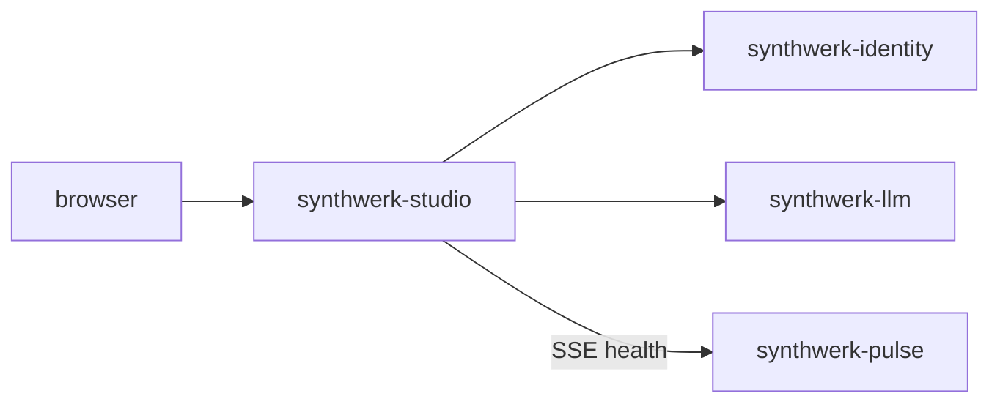

# synthwerk-studio

**Synthwerk** · landing page builder, admin dashboard and live health

## In 30 seconds

- Public site (prerendered), landing page builder, admin dashboard and an app shell for SDK apps.
- Admin: users and roles, widget settings with live preview, AI settings, real-time health section.
- German and English, dark mode from the system, WCAG 2.2 AA, GDPR consent per German law.

## Where it fits

- Ecosystem map: [synthwerk](https://github.com/VelimirMueller/synthwerk).
- Shared CI, lint configs and templates: [synthwerk-blueprint](https://github.com/VelimirMueller/synthwerk-blueprint).

## Status

| Item | State |
|---|---|
| Rewrite | Planned in epic **E4 Studio core** |
| Old code | Tag [`legacy-final`](../../tree/legacy-final): a Vuetify landing page with a placeholder login |
| Branching | `main` deploys to dev, a `vX.Y.Z` tag to stg, an approved digest to prd |

- This repo was renamed. The old URL still redirects here.
